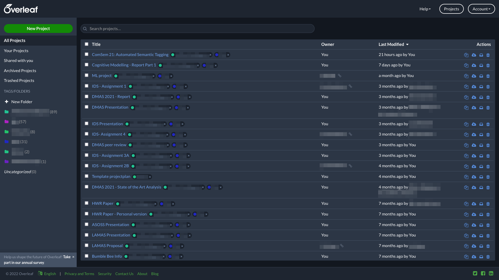

# Overleaf Dark Project Overview

A (very basic) userstyle to make the Overleaf project overview page dark.
Uses colors already used in the UI or derivatives.

## Installation instructions

1. Install the Stylus browser extension ([instructions](https://github.com/openstyles/stylus#releases))
2. Import the style.css file (or click the button at the top of this readme)
3. Done!

## Screenshot

